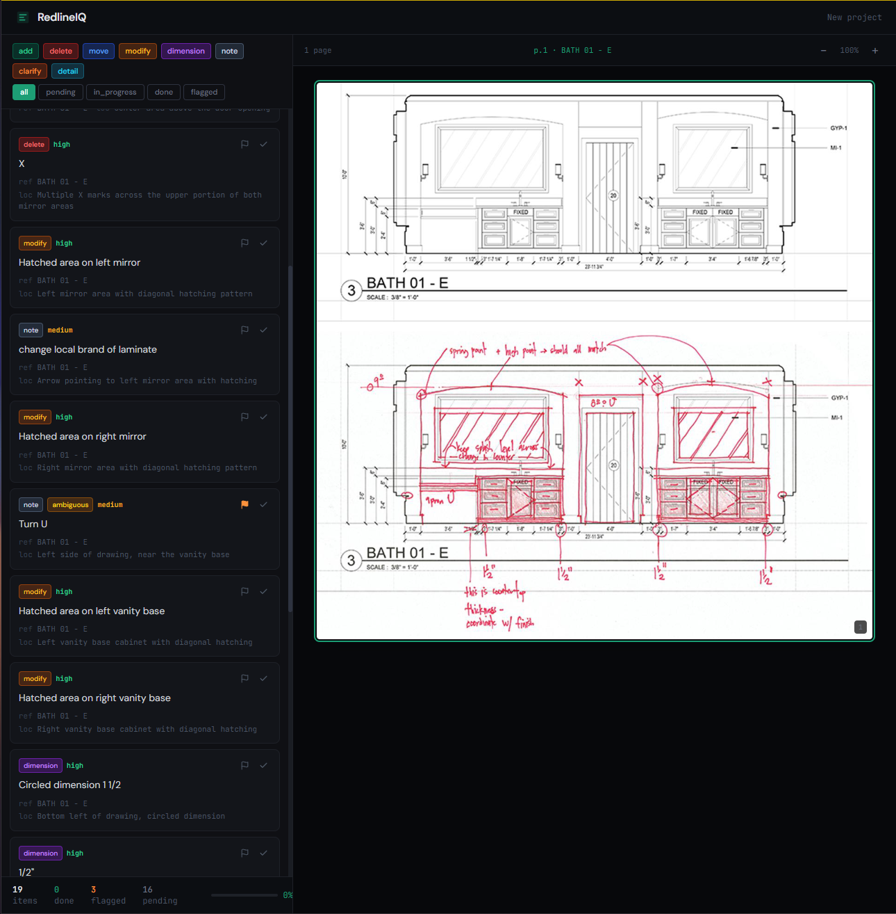

# RedlineIQ

**[Live demo →](https://redlineiq-new.onrender.com)**
Free-tier deploy — first request may take 30–60s to wake up.



## What it does

Redlined plan sets are how engineers mark up drawings for drafters to revise — handwritten annotations scattered across pages, no standard format, no built-in organization. Before any actual drafting can begin, a drafter has to manually read, interpret, and organize every annotation. RedlineIQ eliminates that step. Upload a marked-up PDF and the app uses Claude Vision to extract every annotation into a structured, actionable checklist — categorized by type, location, and confidence, with ambiguous items auto-flagged for clarification.

## Tech stack

- **Frontend:** React + Vite, Tailwind CSS
- **Backend:** Node.js + Express
- **AI:** Claude Sonnet 4 (Vision API)
- **Persistence:** SQLite via better-sqlite3
- **PDF processing:** pdf2pic + GraphicsMagick + Ghostscript
- **Deployment:** Docker on Render

## Architecture

```
PDF Upload → pdf2pic (pages → images) → Claude Vision API → Structured JSON → Checklist
```

### Key files

```
src/
├── index.js                    # Express server entry point
├── config/index.js             # Environment configuration
├── models/markup.js            # Data model, types, helpers
├── services/
│   ├── db.js                   # SQLite connection and schema setup
│   ├── extraction-service.js   # Core AI extraction (Claude Vision)
│   ├── job-service.js          # Async extraction job runner + SSE events
│   └── project-service.js      # Project & checklist state management
├── routes/api.js               # REST API endpoints
├── utils/pdf-converter.js      # PDF → image conversion
└── scripts/extract-cli.js      # CLI tool for standalone extraction
```

### Data model

Each extracted markup contains:
- `id` — Unique identifier (MK-001, MK-002, ...)
- `markup_text` — The annotation content ("[illegible]" for unreadable text)
- `markup_type` — add, delete, move, modify, dimension, note, clarify, detail
- `drawing_reference` — Sheet number (A-201, C-3.1)
- `location_on_drawing` — Spatial description on the sheet
- `related_to` — Links cloud/circle annotations to their text notes
- `confidence` — high, medium, low
- `ambiguous` — Whether the intent is unclear (auto-flags for clarification)

## Setup

```bash
# 1. Install dependencies
npm install

# 2. Configure environment
cp .env.example .env
# Add your ANTHROPIC_API_KEY to .env

# 3. Run tests (no API key needed)
npm test

# 4. Start the server
npm run dev
```

## Usage

### CLI (for testing extraction)

```bash
# Extract from a PDF
node src/scripts/extract-cli.js ./path/to/redlined-drawing.pdf

# Extract specific pages with verbose output
node src/scripts/extract-cli.js ./drawing.pdf --pages 1,3 --verbose

# Save results to file
node src/scripts/extract-cli.js ./drawing.pdf --output ./results.json
```

### API

```bash
# Upload a PDF and create a project
curl -X POST http://localhost:3001/api/projects \
  -F "pdf=@./drawing.pdf" \
  -F "name=Kitchen Renovation"

# Run extraction (returns jobId, then stream progress via SSE)
curl -X POST http://localhost:3001/api/projects/{id}/extract

# Stream extraction progress
curl -N http://localhost:3001/api/jobs/{jobId}/status

# Update a checklist item
curl -X PATCH http://localhost:3001/api/projects/{id}/items/MK-001 \
  -H "Content-Type: application/json" \
  -d '{"status": "done", "notes": "Updated in CAD"}'

# Flag an item for clarification
curl -X POST http://localhost:3001/api/projects/{id}/items/MK-002/flag \
  -H "Content-Type: application/json" \
  -d '{"message": "Cannot read dimension — is this 4'\''6\" or 4'\''8\"?"}'

# Get project summary
curl http://localhost:3001/api/projects/{id}/summary
```

## System requirements

- Node.js 18+
- GraphicsMagick or ImageMagick (for pdf2pic)
  - Mac: `brew install graphicsmagick`
  - Ubuntu: `sudo apt install graphicsmagick`
- An Anthropic API key

## Deployment

### Environment variables

| Variable | Required | Default | Description |
|---|---|---|---|
| `ANTHROPIC_API_KEY` | Yes | — | Your Anthropic API key |
| `DATABASE_PATH` | No | `./data/redlineiq.db` | Path to SQLite file. On Render/Railway, point this at a persistent volume (e.g. `/var/data/redlineiq.db`) so data survives redeploys. |
| `DEMO_MODE` | No | `false` | Set to `true` to require `X-Demo-Key` header on POST /extract. GET routes stay public. |
| `DEMO_KEY` | If DEMO_MODE=true | — | The key callers must supply in the `X-Demo-Key` request header to run extractions. |
| `MAX_FILE_SIZE_MB` | No | `20` | Max PDF upload size in MB. |
| `MAX_PAGES` | No | `10` | Max pages per PDF. Checked at upload and again before extraction. |
| `PORT` | No | `3001` | HTTP port. |

### Render notes

- The app is deployed as a Docker service so GraphicsMagick and Ghostscript are available as system binaries.
- Add a **persistent disk** mounted at `/var/data` and set `DATABASE_PATH=/var/data/redlineiq.db` when upgrading from free tier. Without it, the SQLite file is wiped on every redeploy.
- The `uploads/` directory is ephemeral — uploaded PDFs won't survive a redeploy. For production, move uploads to object storage (S3/R2).

## Engineering decisions

- **Async job pattern with SSE** rather than a synchronous POST response — extraction on a multi-page PDF takes tens of seconds per page. A synchronous approach would time out at the load balancer. The job service runs extraction in the background and streams per-page progress events to the client over SSE.
- **SQLite over JSON file persistence** — the JSON approach required reading and rewriting the entire dataset on every checklist update. SQLite gives row-level writes, survives concurrent requests cleanly, and needs no separate database service to operate.
- **Docker deploy to install system deps** — pdf2pic delegates PDF rendering to GraphicsMagick and Ghostscript, which are OS-level binaries. The default Render Node runtime doesn't include them. A Dockerfile makes the dependency explicit and reproducible.
- **Per-IP rate limiting with a 10-page cap** — each extraction page hits the Claude Vision API. Without limits, a single user could run up significant API costs on a public demo. The extraction endpoint is capped at 3 jobs/hour per IP; uploads are rejected above 10 pages.

## Next steps

- [ ] Clarification workflow — engineer response loop for ambiguous markups (currently auto-flagged but no reply path)
- [ ] Export — download progress report as PDF or CSV for handoff
- [ ] Multi-sheet plan sets — improve handling of large plan sets with cross-sheet references and consistent sheet numbering
- [ ] Sample library — pre-extracted example projects so visitors can explore the checklist UI without uploading their own drawings
