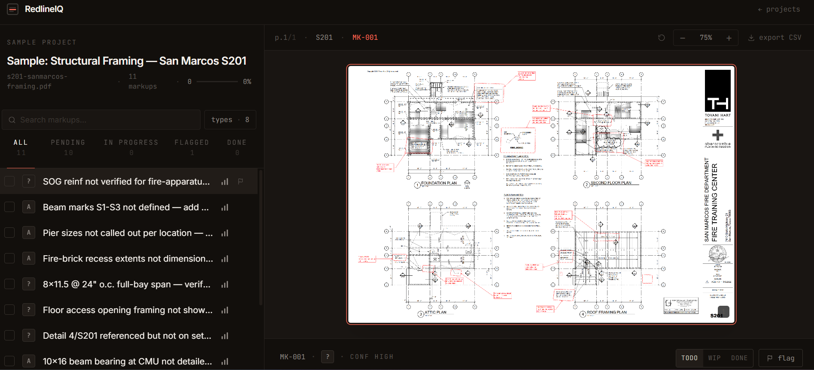

# RedlineIQ

[](https://github.com/nick-furr/redlineiq/actions/workflows/ci.yml)
[](#eval-harness)

**[Live demo →](https://redlineiq-app.onrender.com)** &nbsp;·&nbsp; **[Walkthrough video →](https://www.loom.com/share/db6edb1fedf340e3a901dd07fc224867)**



> **Project status — portfolio / maintenance mode.** Active feature work is paused as of June 2026. This is a working, deployed snapshot built to demonstrate an end-to-end AI extraction pipeline; it is not under active development. See [`STATE.md`](STATE.md) for where things stand and what I'd pick up next if I resumed.

## What it does

Redlined plan sets are how engineers mark up drawings for drafters to revise — handwritten annotations scattered across pages, no standard format, no built-in organization. Before any actual drafting can begin, a drafter has to manually read, interpret, and organize every annotation. RedlineIQ eliminates that step. Upload a marked-up PDF and the app uses Claude to extract every annotation into a structured, actionable checklist — categorized by type, location, and confidence, with ambiguous items auto-flagged for clarification. Under the hood it's a **hybrid pipeline**: digital PDFs are parsed losslessly straight from the file, while scanned or flattened sheets fall through to tiled Claude Vision — see [Architecture](#architecture--hybrid-parsevision-pipeline) below.

## Tech stack

- **Frontend:** React + Vite, Tailwind CSS
- **Backend:** Node.js + Express
- **AI:** Claude Sonnet 4.6 — Vision API (tiled raster path) + text-only calls (digital parse path)
- **Persistence:** SQLite via better-sqlite3
- **PDF processing:** pdfjs-dist (annotation parsing + source-type probe); pdf2pic + GraphicsMagick + Ghostscript (rasterization & tiling)
- **Observability:** LangFuse (LLM tracing) + Sentry (error tracking) — both optional, enabled via env
- **Deployment:** Docker on Render

## Architecture — hybrid parse/vision pipeline

RedlineIQ runs a **hybrid extraction pipeline**: every upload is classified by source type *before* any work, then routed down the cheapest path that fits — digital PDFs are parsed losslessly with no Vision call at all; everything else falls through to tiled Claude Vision.

```
PDF upload
  └─ probe annotation layer (pdfjs-dist)
       ├─ digital w/ live annotations → PARSE path: read markup text + exact
       │     coordinates straight from the PDF, then one cheap text-only Claude
       │     call for semantic labels. No rasterization, no Vision.
       └─ scanned / flattened / raster → TILED VISION path: split each page into
             ≤1568px tiles (Sonnet's resize ceiling), run Claude Vision per tile,
             merge + dedup, then precision post-process.
                                  ↓
              Structured JSON → SQLite → categorized, confidence-scored checklist
```

Both paths return the same result shape, so persistence, the job runner, and the UI are path-agnostic. The async job runner (`job-service.js`) streams per-page progress to the client over SSE. The CLI applies the same source-type routing.

### Key files

```
src/
├── index.js                         # Express server entry point (loads Sentry first)
├── instrument.js                    # Sentry initialization
├── config/index.js                  # Environment configuration
├── models/markup.js                 # Data model, types, helpers
├── services/
│   ├── db.js                        # SQLite connection and schema setup
│   ├── job-service.js               # Async job runner: probes source, routes path, streams SSE
│   ├── parse-extraction-service.js  # Digital path — lossless annotation parse + text-only label call
│   ├── tiled-extraction-service.js  # Raster path — per-tile Vision extraction, merge/dedup, postprocess
│   ├── extraction-service.js        # Single-page Claude Vision (used by CLI + eval baseline)
│   ├── markup-postprocess.js        # Precision filters applied to merged tiled output
│   ├── project-service.js           # Project & checklist state management
│   └── langfuse.js                  # LangFuse LLM-tracing client
├── routes/api.js                    # REST API endpoints
├── utils/
│   ├── pdf-annotation-probe.js      # Source-type probe + extraction-path router
│   ├── pdf-tiler.js                 # PDF page → overlapping ≤1568px tiles
│   └── pdf-converter.js             # PDF → image conversion
└── scripts/extract-cli.js           # CLI tool (same source-type routing as the app)

prompts/
├── active.md                   # Runtime prompt (loaded by extraction-service.js)
├── v0.6.md, v0.7.md, v0.8.md, v0.9.md  # Versioned snapshots with YAML frontmatter
└── CHANGELOG.md                # Prompt iteration history with hypothesis/delta/rationale

docs/decisions/                 # Architecture Decision Records (Nygard format)
```

### Data model

Each extracted markup contains:
- `id` — Unique identifier (MK-001, MK-002, ...)
- `markup_text` — The annotation content ("[illegible]" for unreadable text)
- `markup_type` — add, delete, move, modify, dimension, note, clarify, detail
- `drawing_reference` — Sheet number (A-201, C-3.1)
- `location_on_drawing` — Spatial description on the sheet
- `related_to` — Links cloud/circle annotations to their text notes
- `confidence` — high, medium, low
- `ambiguous` — Whether the intent is unclear (auto-flags for clarification)

## Setup

```bash
npm install
cp .env.example .env       # then add your ANTHROPIC_API_KEY
npm test                   # no API key needed
npm run dev
```

Full setup walkthrough (Node version pinning, GraphicsMagick + Ghostscript install, platform notes, troubleshooting): [`DEV_SETUP.md`](DEV_SETUP.md).

## Usage

### CLI (for testing extraction)

```bash
# Extract from a PDF
node src/scripts/extract-cli.js ./path/to/redlined-drawing.pdf

# Extract specific pages with verbose output
node src/scripts/extract-cli.js ./drawing.pdf --pages 1,3 --verbose

# Save results to file
node src/scripts/extract-cli.js ./drawing.pdf --output ./results.json
```

### API

```bash
# Upload a PDF and create a project
curl -X POST http://localhost:3001/api/projects \
  -F "pdf=@./drawing.pdf" \
  -F "name=Kitchen Renovation"

# Run extraction (returns jobId, then stream progress via SSE)
curl -X POST http://localhost:3001/api/projects/{id}/extract

# Stream extraction progress
curl -N http://localhost:3001/api/jobs/{jobId}/status

# Update a checklist item
curl -X PATCH http://localhost:3001/api/projects/{id}/items/MK-001 \
  -H "Content-Type: application/json" \
  -d '{"status": "done", "notes": "Updated in CAD"}'

# Flag an item for clarification
curl -X POST http://localhost:3001/api/projects/{id}/items/MK-002/flag \
  -H "Content-Type: application/json" \
  -d '{"message": "Cannot read dimension — is this 4'\''6\" or 4'\''8\"?"}'

# Get project summary
curl http://localhost:3001/api/projects/{id}/summary

# Ask a question about the project's markups (RAG — FTS5 retrieval + grounded
# Claude answer citing markup IDs, see ADR 0004)
curl -X POST http://localhost:3001/api/projects/{id}/ask \
  -H "Content-Type: application/json" \
  -d '{"question": "Which sheets have dimension changes?"}'
```

## System requirements

- Node.js 22.14.0 (pinned via `.nvmrc`; `nvm use` picks it up)
- GraphicsMagick or ImageMagick (for pdf2pic)
  - Mac: `brew install graphicsmagick`
  - Ubuntu: `sudo apt install graphicsmagick`
  - Windows: `scoop install graphicsmagick ghostscript`
- An Anthropic API key

## Deployment

### Environment variables

| Variable | Required | Default | Description |
|---|---|---|---|
| `ANTHROPIC_API_KEY` | Yes | — | Your Anthropic API key |
| `CLAUDE_MODEL` | No | `claude-sonnet-4-6` | Claude model version for extraction. |
| `REDLINEIQ_PROMPT_FILE` | No | `prompts/active.md` | Override the runtime prompt source. Used by the eval harness to A/B compare versions. |
| `DATABASE_PATH` | No | `./data/redlineiq.db` | Path to SQLite file. On Render/Railway, point this at a persistent volume (e.g. `/var/data/redlineiq.db`) so data survives redeploys. |
| `DEMO_MODE` | No | `false` | Set to `true` to require `X-Demo-Key` header on POST /extract. GET routes stay public. |
| `DEMO_KEY` | If DEMO_MODE=true | — | The key callers must supply in the `X-Demo-Key` request header to run extractions. |
| `MAX_FILE_SIZE_MB` | No | `20` | Max PDF upload size in MB. |
| `MAX_PAGES` | No | `10` | Max pages per PDF. Checked at upload and again before extraction. |
| `PORT` | No | `3001` | HTTP port. |
| `OUTPUT_DIR` | No | `./output` | Directory for processed extraction output files. |
| `LANGFUSE_PUBLIC_KEY` | No | — | LangFuse public key. LLM tracing is disabled unless both LangFuse keys are set. |
| `LANGFUSE_SECRET_KEY` | No | — | LangFuse secret key. |
| `LANGFUSE_BASE_URL` | No | `https://cloud.langfuse.com` | Override only when self-hosting LangFuse. |
| `SENTRY_DSN` | No | — | Sentry DSN for error tracking. Disabled if unset. |
| `SENTRY_TRACES_SAMPLE_RATE` | No | — | Sentry performance-trace sample rate (e.g. `0.1`). |

### Render notes

- The app is deployed as a Docker service so GraphicsMagick and Ghostscript are available as system binaries.
- Add a **persistent disk** mounted at `/var/data` and set `DATABASE_PATH=/var/data/redlineiq.db` when upgrading from free tier. Without it, the SQLite file is wiped on every redeploy.
- The `uploads/` directory is ephemeral — uploaded PDFs won't survive a redeploy. For production, move uploads to object storage (S3/R2).

## Engineering decisions

- **Async job pattern with SSE** rather than a synchronous POST response — extraction on a multi-page PDF takes tens of seconds per page. A synchronous approach would time out at the load balancer. The job service runs extraction in the background and streams per-page progress events to the client over SSE.
- **SQLite over JSON file persistence** — the JSON approach required reading and rewriting the entire dataset on every checklist update. SQLite gives row-level writes, survives concurrent requests cleanly, and needs no separate database service to operate.
- **Docker deploy to install system deps** — pdf2pic delegates PDF rendering to GraphicsMagick and Ghostscript, which are OS-level binaries. The default Render Node runtime doesn't include them. A Dockerfile makes the dependency explicit and reproducible.
- **Per-IP rate limiting with a 10-page cap** — each extraction page hits the Claude Vision API. Without limits, a single user could run up significant API costs on a public demo. The extraction endpoint is capped at 3 jobs/hour per IP; uploads are rejected above 10 pages.
- **Prompt loaded from `prompts/active.md` at startup** — the system prompt isn't hardcoded. The eval harness uses `REDLINEIQ_PROMPT_FILE` to point at a specific version when comparing head-to-head, so prompt iteration doesn't need a code change. System prompt has `cache_control: ephemeral` set; whether it caches depends on hitting the model's minimum token threshold (verify via `usage.cache_read_input_tokens`).

Longer-form decisions live in [`docs/decisions/`](docs/decisions/). See [`prompts/CHANGELOG.md`](prompts/CHANGELOG.md) for prompt iteration history.

## Eval harness

RedlineIQ includes a structured eval harness for measuring extraction quality against synthetic redlined drawings.

```bash
# Score the current active prompt against the working set
npm run eval

# Compare a different version head-to-head — loads prompts/v0.7.md if it exists
node evals/run-eval.js --prompt v0.7 --working-set
```

Outputs a JSON run file and an HTML report to `evals/runs/`. Each run scores three metrics:

| Metric | Description | Target |
|---|---|---|
| **Recall** | Fraction of expected markups captured | ≥ 0.80 |
| **Precision** | Fraction of extracted markups that matched something expected | ≥ 0.70 |
| **Specificity** | Avg specificity weight of matched items (rewards detail) | ≥ 1.50 |

**Current pinned baseline (v0.9, 9 working-set cases, fully deterministic config):** recall=0.665 · precision=0.687 · specificity=1.509

The earlier 5/24 figure of 0.811 was measured against a non-deterministic stack (both extraction and judge defaulted to API `temperature: 1.0`). After pinning `temperature: 0` on both calls per ADR 0003, the eval is stable across runs (aggregate σ ≈ 0.003). The lower number is honest signal, not a regression. v0.9's two-pass `## Process` prompt change still earns its keep — bare-mark recall, the sub-metric it was designed to move, holds at the pinned config.

**Tiling (now the production raster path).** For sheets where source resolution exceeds Anthropic's ~1568 px server-side resize cap for Sonnet 4.6, splitting the PDF into ≤1568 px-long-edge tiles and merging per-tile extractions cracks the model-resolution ceiling. **case_006** (real hand-drawn bathroom elevation, stuck at recall ≤0.538 for two weeks across every prompt iteration) lifted to recall=0.538 + precision=0.636 (vs the pre-tiling baseline 0.231 / 0.273) — biggest single-case recall gain in the project to date. Tiling now ships as the production Vision path for raster/scanned sources, with `markup-postprocess.js` filtering the worst false positives the merge introduces. The remaining refinement is **conditional tiling** — tile only when a sheet's resolution actually demands it, rather than every raster page, since indiscriminate tiling still inflates extracted count on clean sheets.

Prompt versions are tracked in [`prompts/CHANGELOG.md`](prompts/CHANGELOG.md). The active prompt is [`prompts/active.md`](prompts/active.md), loaded by `extraction-service.js` at startup. (`active.md` is **v0.10** — a defense-in-depth "never fabricate" clause layered on v0.9. It is *not* the confabulation fix: tiling addressed the root cause, illegibility; the prose guard alone failed its objective, see the CHANGELOG v0.10 entry. **v0.9 remains the pinned aggregate baseline** because v0.10's prompt-only delta is unattributable at the aggregate.) Judgment uses Claude Haiku at `temperature: 0` (single deterministic call per pair; the prior 3x majority-vote pattern was a band-aid for the temperature default and is now removed), matching by conceptual equivalence rather than literal text. Case naming and the substrate × markup realism taxonomy are documented in [`evals/CONVENTIONS.md`](evals/CONVENTIONS.md).

Determinism characterization: aggregate σ ≈ 0.003 across runs. Per-case has soft variance (σ ≈ 0.05) on borderline judgments due to Anthropic-side residual non-determinism at temp=0. Rule of thumb: aggregate moves >0.02 are signal; per-case moves >0.1 on borderline cases are signal. See `prompts/CHANGELOG.md` "v0.9 (rebaselined)" entry for full numbers and ADR 0003 for the architectural decision.

## AI-assisted engineering

The repo doesn't just *use* Claude in the product — the engineering workflow itself is agentic, and the tooling is checked in:

- **A Claude Code agent team** ([`.claude/agents/`](.claude/agents/)) encodes this project's real constraints as reviewable subagents: [`eval-analyst`](.claude/agents/eval-analyst.md) (interprets eval runs against the pinned baseline with the project's actual signal/noise thresholds), [`prompt-reviewer`](.claude/agents/prompt-reviewer.md) (gates prompt changes on versioning + determinism discipline), [`code-reviewer`](.claude/agents/code-reviewer.md) (holds diffs to the architecture invariants), and [`pipeline-debugger`](.claude/agents/pipeline-debugger.md) (systematic triage against the known failure taxonomy in `STATE.md`).
- **A project skill** ([`.claude/skills/prompt-iteration/`](.claude/skills/prompt-iteration/SKILL.md)) makes the prompt-versioning workflow executable: hypothesis → immutable snapshot → changelog → working-set eval → threshold comparison. Failed experiments get recorded, not deleted.
- **CI-integrated AI review** ([`.github/workflows/claude-review.yml`](.github/workflows/claude-review.yml)) — every non-draft PR gets a Claude Code review against the same conventions the local agents enforce.
- **RAG over extraction output** — `POST /api/projects/{id}/ask` answers questions about a project's markups, grounded in retrieved items and citing markup IDs. Retrieval is SQLite FTS5 (BM25, trigger-synced, zero new dependencies) rather than embeddings — a deliberate, documented trade-off for this corpus shape ([ADR 0004](docs/decisions/0004-fts5-retrieval-for-ask.md)). The retrieval layer is fully covered by offline tests; CI never makes an API call.

## Next steps

- [ ] Bare-mark recall — 57.9% aggregate on v0.9 (11 of 19 bare `verify?` / `??` markers caught, up from 37.5% on v0.8). Two-pass extraction lifted +0.204 on civil/arch cases but does not yet generalize: cases 003 (utility), 008 (electrical), and 010 (structural) each caught 0/2 because the Pass 2 checklist examples are civil/arch-flavored. Next lever: extend Pass 2 examples to MEP/structural language, or move to per-discipline few-shot
- [ ] More real-world cases — case_011 (real Bohler grading plan, was case_R001) scored well on digital self-authored markups. case_006 (real public plan + real reviewer markup, photographed) had been the ceiling case — recall 0.231 at the pinned baseline — until the 5/28 tiling experiment lifted it to 0.538 — and tiling has since shipped as the production raster path, so that gain is live. See [`evals/CONVENTIONS.md`](evals/CONVENTIONS.md) for the substrate × markup taxonomy used to slice these
- [ ] Conditional tiling — production currently tiles *every* raster page; gate it on actual sheet resolution (and tighten merge dedup) so clean low-res scans skip the precision hit that indiscriminate tiling causes. Source-type detection itself already ships (`pdf-annotation-probe.js`)
- [ ] Clarification workflow — engineer response loop for ambiguous markups (currently auto-flagged but no reply path)
- [ ] PDF export — checklist is exportable as CSV today; a formatted PDF report for handoff is not yet implemented
- [ ] Architecture decisions — 3 ADRs written ([`docs/decisions/`](docs/decisions/)), 3 more queued (max_tokens, sample isolation, Docker-on-Render)
